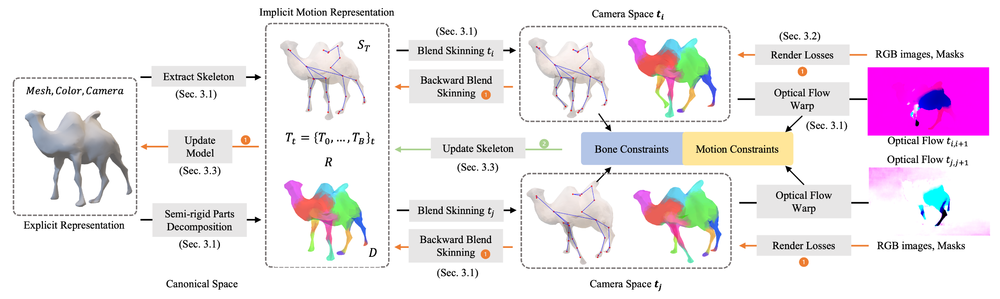
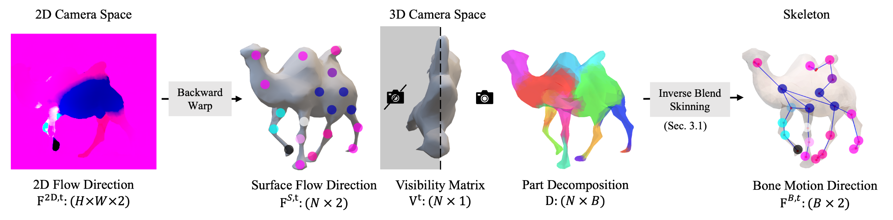
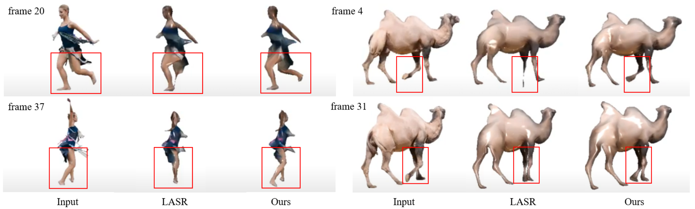
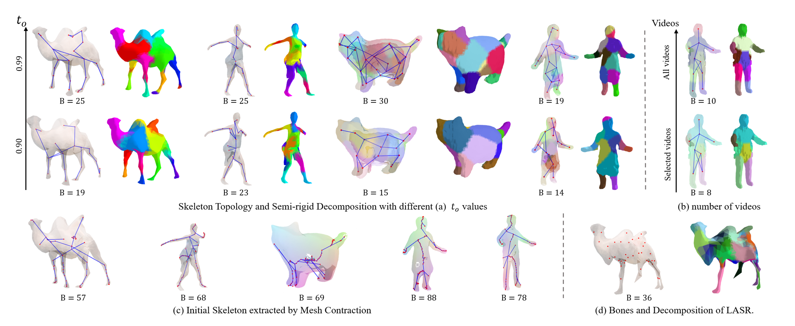
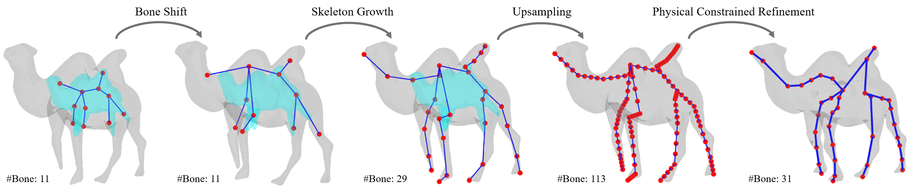
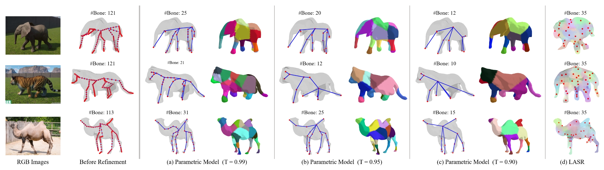

  <h2 align="center">LEARNING IMPLICIT REPRESENTATION FOR RECONSTRUCTING ARTICULATED OBJECTS</h2>
  

    <a href="https://haoz19.github.io/"><strong>Hao Zhang</strong></a>1
    ·
    <a href="https://www.linkedin.com/in/fang-li-8ab696223/"><strong>Fang Li</strong></a>1
    ·
    <a href="https://vision.ai.illinois.edu/narendra-ahuja/"><strong>Narendra Ahuja</strong></a>1
     
    1University of Illinois Urbana-Champaign &nbsp;&nbsp;&nbsp;
     
     
        
<!--          -->
        <!--  -->
      
    <table align="center">
      <strong>Overview:
        
    </table>
    <table align="center">
      <strong>Optical Flow Wrap:
        
    </table>
    <table align="center">
      <strong>Render Results:
        
    </table>

*We treat an articulated object as an unknown, semi-rigid skeletal structure surrounded by nonrigid material (e.g.,
skin). Our method simultaneously estimates the visible (explicit) representation (3D shapes, colors, camera parameters) and the implicit skeletal representation, from motion cues in the object video without 3D supervision. Our implicit representation consists of four parts. (1) Skeleton, which specifies how semi-rigid parts are connected. (2) Skinning Weights, which associates each surface vertex with semi-rigid parts with probability. (3) Rigidity Coefficients, specifying the articulation of the local surface. (4) Time-Varying Transformations, which specify the skeletal motion and surface deformation parameters. We introduce an algorithm that uses physical constraints as regularization terms and iteratively estimates both
implicit and explicit representations. Our method is category-agnostic, thus eliminating the need for category-specific skeletons.*

<table align="center">
     
</table>

  <h2 align="center">S3O: A Dual-Phase Approach for Reconstructing Dynamic Shape and Skeleton</h2>
  

    <a href="https://haoz19.github.io/"><strong>Hao Zhang</strong></a>1
    ·
    <a href="https://www.linkedin.com/in/fang-li-8ab696223/"><strong>Fang Li</strong></a>1
    ·
    <a href="https://vision.ai.illinois.edu/narendra-ahuja/"><strong>Narendra Ahuja</strong></a>1
     
    1University of Illinois Urbana-Champaign &nbsp;&nbsp;&nbsp;
     
     
        
<!--          -->
        <!--  -->
      
    <table align="center">
        
    </table>

*We propose Synergistic Shape and Skeleton Optimization (S3O), a novel two-phase method that forgoes these prerequisites
and efficiently learns parametric models including visible shapes and underlying skeletons. Conventional strategies typically learn all parameters simultaneously, leading to interdependencies where a single incorrect prediction can result in significant errors. In contrast, S3O adopts a phased
approach: it first focuses on learning coarse parametric models, then progresses to motion learning and detail addition. This method substantially lowers computational complexity and enhances robustness in reconstruction from limited viewpoints, all without requiring additional annotations.*

<table align="center">
     
</table>

## News
* **[2024.5.21]** Code is coming soon.
* **[2024.5.21]** Release S3O [Paper](https://arxiv.org/pdf/2405.12607)
* **[2024.1.16]** Release LIMR [Paper](https://arxiv.org/abs/2401.08809)

*For 4D Motion Transfer, please also check our new work [MagicPose4D](https://github.com/haoz19/MagicPose4D)!*
